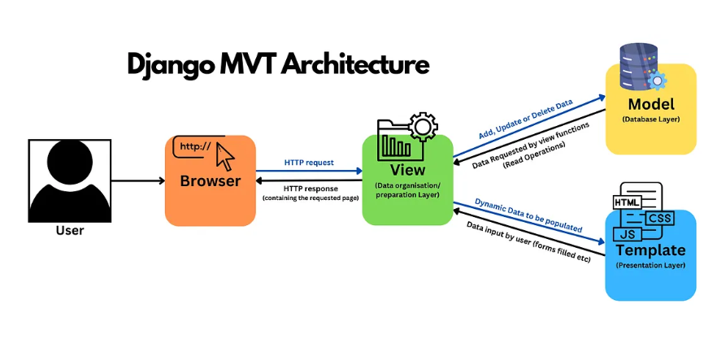

# Intro to Django (Installation, MVT, Structures, App)
Django adalah framework berbasis Python untuk membangun aplikasi web dengan cepat, aman, dan scalable.

## Tutorial Instalasi Django
**Langkah 1: Install Python**

`python --version`<br/>
Pastikan versionnya 3.x, kalau versionnya ga sesuai (kurang dari 3.x) download dari link:
https://www.python.org/downloads/

**Langkah 2: Instalasi Django**<br/>
`pip install django`

Cek versi<br/>
`django-admin --version`

**Langkah 3: Membuat Direktori dan Menyiapkan Virtual Environment**

Note: Direktori tuh sama aja dengan folder yaa<br/>

Virtual environment (venv) adalah environment python terisolasi. Dibuat folder khusus berisi python dan library untuk satu projek. Jadi untuk tiap projek kalian dependenciesnya ga saling ganggu.

**Kenapa Perlu Virtual Env?**<br/>
Dengan virtual environment<br/>
✅ Setiap project punya library sendiri, minim konflik<br/>
✅ Environment project lebih rapi, gampang dipindah/di-deploy.<br/>
✅ Best practice.<br/>
✅ Pip list di dalam venv cuma berisi yang memang project itu butuh.

Tanpa virtual environment<br/>
⚠️ Semua package ke-install global cenderung numpuk, berantakan.<br/>
⚠️ Konflik version (project A butuh Django 4, project B butuh Django 5).<br/>
⚠️ Susah tracking dependency spesifik project.<br/>
⚠️ Kalau upgrade/downgrade 1 package, bisa buat project lain gabisa di run lokal.<br/>

1. Buat folder baru
2. Dalam direktori tersebut buka command prompt atau terminal. Atau dapat juga dibuka dengan VScode.

3. Jalankan command berikut.

Membuat env<br/>
`python -m venv env`

Mengaktifkan env<br/>
- windows<br/>
`env\Scripts\activate`<br/>
- linux<br/>
`source env/bin/activate`<br/>

Apabila env sudah menyala, akan terlihat dengan tulisan (env) di line terminal

Mematikan env<br/>
`deactivate`

**Langkah 4: Menyiapkan Dependencies dan Membuat Projek Django**

Dependencies adalah komponen atau modul yang diperlukan oleh suatu perangkat lunak untuk berfungsi, termasuk library, framework, atau package. Hal tersebut memungkinkan pengembang memanfaatkan kode yang telah ada, mempercepat pengembangan, tetapi juga memerlukan manajemen yang hati-hati untuk memastikan kompatibilitas versi yang tepat. Penggunaan virtual environment membantu mengisolasi dependencies antara proyek-proyek yang berbeda.

1. Pada direktori yang sama, buat file `requiirements.txt` dan tambahkan dependency berikut<br/>
```
django
gunicorn
whitenoise
psycopg2-binary
requests
urllib3
```

2. Lakukan instalasi dependencies yang ada dengan perintah berikut. (Jalankan venv sebelum menjalankan perintah ini)

`pip install -r requirements.txt`

3. Buat proyek Django dengan nama bebas, buat dengan perintah berikut.<br/>
`django-admin startproject nama_proyek .`<br/>
Note: Pastikan karakter `.` tertulis diakhir command<br/>

**Langkah 5: Konfigurasi dan Menjalankan Server**
1. Tambahkan string berikut pada ALLOWED_HOSTS di settings.py untuk keperluan deployment<br/>
```
...
ALLOWED_HOSTS = ["localhost", "127.0.0.1"]
...
```
Dalam konteks deployment, ALLOWED_HOSTS berfungsi sebagai daftar host yang diizinkan untuk mengakses aplikasi web. Disini kita meng set `localhost` dan ip `127.0.0.1` pada ALLOWED_HOSTS, artinya kita memberi izin ke peramban lokal kita untuk dapat meng run aplikasi secara lokal.<br/>

Note: Variabel inilah yang kita edit agar aplikasi kita dapat dibuka pada saat deployment.

2. Menjalankan Server<br/>
Pastikan bahwa berkas manage.py ada pada direktori yang aktif pada terminal kamu saat ini. Untuk menjalankan server Django, jalankan perintah berikut:
- windows<br/>
`python manage.py runserver`<br/>
- linux<br/>
`python3 manage.py runserver`<br/>

3. Buka server django pada browser favorit anda dengan memasukkan link http://localhost:8000. Apabila proyek Django di setup dengan benar, anda akan melihat animasi roket :D.

**Langkah 4: Mematikan Server**
1. Matikan server dengan menekan `ctrl + c` pada terminal anda
2. Matikan venv dengan menginput `deactivate`.

## Django MVT



### Terminologi

**MVT** adalah singkatan dari **Model-View-Template**, yakni arsitektur yang digunakan oleh Django untuk memisahkan logika aplikasi, tampilan data, dan presentasi interface.<br/>

**Note:** Arsitektur sebenarnya ada banyak (MVC, MVVM, dll). Tapi karena Django menggunakan MVT, disini kita fokusnya bahas MVT.

**Apa Itu Model?**<br/>
**Model** adalah komponen dalam arsitektur MVT yang berfungsi untuk mengelola data dan logika bisnis. Model biasanya berupa kelas Python yang merepresentasikan tabel dalam database, sehingga memungkinkan pengembang untuk mendefinisikan struktur data, relasi antar data, serta melakukan operasi CRUD (Create, Read, Update, Delete). Dengan model, pengelolaan data menjadi lebih terstruktur.

**Apa Itu Views?**<br/>
**View** adalah bagian dari MVT yang bertindak sebagai penghubung antara Model dan Template. View menerima permintaan (request) dari pengguna, memproses logika aplikasi, mengambil data dari Model bila diperlukan, lalu mengirimkan data tersebut ke Template untuk ditampilkan.

**Apa Itu Template?**<br/>
**Template** adalah komponen dalam MVT yang berfungsi untuk mengatur bagaimana data ditampilkan kepada pengguna. Template ditulis dalam HTML dengan tambahan template tags Django, sehingga memungkinkan integrasi langsung antara data dari View dan elemen tampilan.

**Inti MVT**<br/>
**Model:** Menyimpan data dan logika aplikasi. <br/>
**Views:** Menampilkan data dari model dan menghubungkannya dengan template.<br/>
**Template:** Interface untuk user<br/>

### Manfaat
- Separation of Concern<br/>
MVT memisahkan dengan jelas antara data (Model), logika aplikasi (View), dan tampilan (Template). Setiap bagian kode memiliki peran yang spesifik.

- Codebase Mudah Dikelola<br/>
Karena struktur kode terorganisasi, developer dapat memperbaiki atau mengubah salah satu bagian tanpa harus mengganggu bagian lainnya. 

- Efisiensi Development <br/>
Karena Django sudah menyediakan kerangka kerja bawaan, developer tidak perlu membuat sistem dari nol.

## Struktur App Django
Pada app yang kalian buat `nama_proyek`, perhatikan struktur foldernya, harusnya struktur folder seperti berikut
```
nama_proyek/
├── manage.py
├── nama_proyek
│   ├── __init__.py
│   ├── asgi.py
│   ├── settings.py
│   ├── urls.py
│   └── wsgi.py
```

**Penjelasan tiap file/folder:**<br/>
- **nama_proyek/:** folder utama project Django.<br/>
- **manage.py:** skrip utama untuk menjalankan perintah Django (runserver, migrate, dll.).<br/>
- **init.py:** menandakan folder ini adalah Python package.<br/>
- **asgi.py:** entry point untuk server berbasis ASGI (async).<br/>
- **settings.py:** konfigurasi utama project (database, installed apps, dll.).<br/>
- **urls.py:** routing URL tingkat project (mengarah ke tiap app).<br/>
- **wsgi.py:** entry point untuk server berbasis WSGI (deploy tradisional).<br/>

### Membuat App Pada Proyek Django
**Langkah 1: Persiapan**<br/>
1. Pastikan kamu berada di direktori main projek Django `nama_proyek`<br/>
2. Buka terminal pada direktori tersebut bisa menggunakan command prompt, VSCode, atau CLI favorit kamu.<br/>
3. Aktifkan virtual environment yang telah dibuat sebelumnya.<br/>
- windows<br/>
`env\Scripts\activate`<br/>
- linux<br/>
`source env/bin/activate`<br/>


**Langkah 2: Buat Aplikasi Pada Projek Django**<br/>
1. Jalankan perintah berikut untuk membuat aplikasi baru dengan nama main.<br/>
`python manage.py startapp main`<br/>
Setelah perintah di atas dijalankan, direktori baru dengan nama main akan terbentuk. Direktori main akan berisi struktur awal untuk aplikasi Django kamu.<br/>

2. Tambahkan aplikasi tersebut pada proyek django<br/>
- Buka `settings.py` pada direktori utama proyek.<br/>
- Tambahkan 'main' ke dalam daftar aplikasi yang ada sebagai elemen paling terakhir. Daftar aplikasi dapat kamu akses pada variabel `INSTALLED_APPS`.<br/>
```
INSTALLED_APPS = [
    ...,
    'main'
]
```

Sekian materi minggu ini! Selamat belajar, semoga bermanfaat, dan jangan lupa untuk mengerjakan checkpoint kalian, ya! ✨