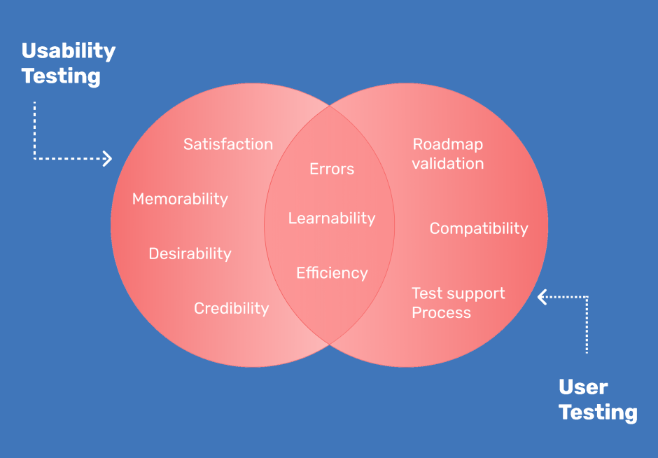

# User Testing (Usability Testing)

Selamat datang di **Week 4!** 👋  

Pada minggu ini, kalian akan mempelajari tentang **User Testing**. Tapi sebelum itu, kita perlu mengetahui terlebih dahulu apa sih User Testing itu, bagaimana prosesnya, serta mengapa hal ini sangat penting dalam pengembangan produk digital. 

---

## Apa Itu User Testing?

**User Testing** adalah proses untuk **menguji dan mengevaluasi interaksi pengguna** dengan sebuah produk, layanan, atau _prototype_ (biasanya aplikasi, _website_, atau sistem). 

Tujuan utamanya adalah memastikan produk tersebut:
- ✅ Mudah digunakan  
- ✅ Efektif dalam membantu pengguna mencapai tujuannya  
- ✅ Sesuai dengan kebutuhan dan harapan pengguna  

:::tip
User Testing membantu kita melihat produk dari **sudut pandang pengguna nyata**, bukan dari asumsi tim desain atau pengembang.
:::

> “User Testing bisa dibilang adalah cara paling jujur untuk memahami apakah produk kita benar-benar berguna bagi pengguna atau engga.”

---

## Tujuan User Testing

1. Mengetahui apakah produk memenuhi kebutuhan pengguna.  
2. Mengidentifikasi masalah UX seperti kesulitan, kebingungan, atau frustrasi.  
3. Meningkatkan kualitas produk sebelum dirilis.  
4. Mengumpulkan data nyata, bukan sekadar opini internal.

:::note
Dengan melakukan _user testing_ sejak awal, kita bisa **menghindari biaya besar akibat revisi desain di tahap akhir**.
:::

---

## Kenapa User Testing Penting?

Kadang desainer, developer, atau product manager merasa produknya sudah mudah digunakan, padahal pengguna akhir bisa aja merasa sebaliknya.  

User Testing membantu kita menemukan:

- Titik-titik di mana pengguna **merasa bingung atau frustasi**  
- Bagian produk yang **tidak sesuai dengan ekspektasi audiens**  
- Kesempatan untuk **memperbaiki UX lebih awal** sebelum peluncuran  

:::info
Hasil user testing dapat menjadi **bukti nyata (evidence-based)** yang membantu tim mengambil keputusan desain untuk iterasi selanjutnya.
:::

---

## Metode dalam User Testing

| Metode | Deskripsi |
|:--|:--|
| **Usability Testing** | Pengguna mencoba tugas tertentu di bawah observasi untuk menilai kemudahan dan efektivitas. |
| **Surveys** | Mengumpulkan feedback kuantitatif dari banyak pengguna melalui kuesioner. |
| **A/B Testing** | Membandingkan dua versi desain untuk melihat mana yang lebih efektif. |
| **Focus Group** | Diskusi kelompok kecil (10–12 orang) untuk memahami persepsi terhadap produk. |
| **Beta Testing** | Pengujian oleh pengguna nyata sebelum produk diluncurkan ke publik. |

---

## User Testing vs Usability Testing

| Aspek | User Testing | Usability Testing |
|:--|:--|:--|
| **Fokus** | Pengalaman pengguna secara keseluruhan (emosi, persepsi, perilaku) | Efisiensi dan kemudahan penggunaan produk |
| **Tujuan** | Apakah produk memenuhi kebutuhan pengguna | Seberapa mudah pengguna menyelesaikan tugas |
| **Cakupan** | Luas, mencakup kepuasan dan motivasi | Spesifik pada interaksi penggunaan |
| **Waktu Pelaksanaan** | Selama seluruh proses pengembangan | Biasanya di tahap prototipe |
| **Hasil** | Insight umum tentang UX | Data spesifik tentang antarmuka |

---

## Jenis-jenis Usability Testing

> #### 🧩 Qualitative  
> Fokus pada *mengapa* pengguna merasa atau bertindak seperti itu. Data diperoleh dari observasi, wawancara, atau survei terbuka.  

> #### 📊 Quantitative  
> Fokus pada data numerik seperti waktu penyelesaian tugas, tingkat keberhasilan, dan jumlah kesalahan.  

> #### 🎤 Moderated  
> Ada moderator yang memandu peserta selama sesi *testing* dan mencatat observasi secara langsung.  

> #### 🖥️ Unmoderated  
> Peserta menjalankan tes sendiri tanpa moderator menggunakan alat otomatis seperti Maze.  

> #### 🌐 Remote  
> Dilakukan secara daring menggunakan alat online untuk memantau interaksi pengguna.  

> #### 🧪 In-Person  
> Dilakukan langsung di laboratorium atau ruangan khusus untuk pengamatan tatap muka yang mendalam.  

---

## Metode Populer dalam Usability Testing

### 1. Lab Usability Testing
- Dilakukan di ruangan khusus di bawah pengawasan moderator. 
- Biasanya ada kaca satu arah agar pengamat dapat melihat tanpa mengganggu peserta.

**Kapan digunakan:**  
Ketika kamu ingin mendapatkan *feedback* verbal mendalam dan observasi langsung dari pengguna.

🎥 [Lab UT](https://youtu.be/7HlXcQhA5rg?si=CQjdg4aJ5zlukiad)

---

### 2. Contextual Inquiry
Melibatkan observasi pengguna **di lingkungan asli mereka**, saat menggunakan produk.  
Empat prinsip utamanya:
1. **Context**: Dilakukan di lingkungan alami pengguna  
2. **Partnership**: Peneliti bekerja sama dengan pengguna  
3. **Interpretation**: Pemahaman dikonfirmasi ke pengguna  
4. **Focus**: Memiliki tujuan riset yang jelas  

🎥 [Contextual Inquiry](https://youtu.be/mOWeNnSY5M0?si=G_rfGvaoVbFHZDNm)

---

### 3. Guerrilla Usability Testing
- Metode cepat dan murah, biasanya dilakukan di tempat umum (seperti kafe). 
- Sesi berlangsung 10–15 menit dengan imbalan kecil.

**Kapan digunakan:**  
Untuk mengumpulkan umpan balik cepat di tahap awal desain.

🎥 [Guerilla UT](https://youtu.be/0YL0xoSmyZI?si=HuxzPycUs1SaBQou)

---

### 4. Phone / Video User Interview
- Moderator mengarahkan peserta melalui panggilan video
- Efektif untuk menjangkau pengguna dari lokasi berbeda dan lebih efisien waktu.

🎥 [Phone Interview](https://youtu.be/BzNhq9hjuAw?si=6XTaQMmmzP1JxzTK)

---

### 5. Session Recording
- Merekam aktivitas pengguna di situs (klik, scroll, navigasi).  
- Berguna untuk melihat bagaimana pengguna benar-benar berinteraksi tanpa intervensi langsung.

---

### 6. Tree Testing
- Menilai apakah struktur navigasi produk sudah intuitif.  
- Pengguna diminta menemukan halaman tertentu berdasarkan sistem menu.

🎥 [Tree Testing 1](https://youtu.be/IVlzrE30K5E?si=V3Bz9AcCilBCgviC)
🎥 [Tree Testing 2](https://youtu.be/BTTxhvBXdao?si=HFIZAsmwgAp2fh5g)

---

## Metrik yang Digunakan

| Metrik | Deskripsi |
|:--|:--|
| ⏱ **Time on Task** | Waktu rata-rata untuk menyelesaikan tugas |
| ✅ **Success Rate** | Persentase tugas yang berhasil diselesaikan |
| ⚠️ **Error Rate** | Jumlah kesalahan yang dilakukan pengguna |
| 😊 **User Satisfaction** | Tingkat kepuasan pengguna terhadap pengalaman mereka |

---

## Alur Pelaksanaan Usability Testing

1. **Menentukan task dan success criteria**  
   **Contoh**: “Pengguna dapat menambahkan produk ke keranjang.”  
2. **Menyiapkan informed consent**, peserta memahami hak dan tujuannya.  
3. **Melaksanakan sesi testing**  
   Fasilitator membacakan skenario, observer mencatat waktu, kesalahan, dan reaksi pengguna.  
4. **Menganalisis hasil dan menyusun laporan**  
   Berisi insight, metrik, dan rekomendasi perbaikan UX.

:::caution
Ingat bahwa **bukan pengguna yang diuji, melainkan produklah yang diuji**.
:::

---

## Metode Tambahan

### ✍️ Survey
Cara cepat dan fleksibel untuk mengumpulkan opini pengguna dalam jumlah besar.

### 🔀 A/B Testing
Menguji dua versi desain (misalnya warna tombol atau teks CTA) untuk melihat mana yang lebih efektif.

### 👥 Focus Group
Diskusi kelompok kecil untuk memahami persepsi, ekspektasi, dan ide dari pengguna nyata.

### 🧩 Beta Testing
Tahap terakhir pengujian, biasanya pada versi produk yang hampir final sebelum peluncuran publik.

---

## Langkah-langkah User Testing

1. Buat **produk atau prototipe** yang akan diuji  
2. Tentukan **metode pengujian** yang sesuai  
3. Rekrut **peserta representatif** dari target audiens  
4. Tentukan **lokasi dan waktu pelaksanaan**  
5. Atur **durasi (30–60 menit)**  
6. Berikan **instruksi yang jelas**
7. **Analisis hasil** dan lakukan iterasi desain

---

## Tools yang Dapat Digunakan

- **Figma**, membuat prototipe interaktif  
- **Maze / Useberry**, remote usability testing  
- **Hotjar / FullStory**, session recording  
- **Google Forms / Typeform**, survei pengguna  
- **Optimal Workshop**, tree testing  

---

## Study Case Mini - "Evaluasi UX Aplikasi Populer"

1. **Pilih satu aplikasi yang kalian paling sering gunakan** (misalnya Tokopedia, Instagram, Gojek, Shopee, dll). 
2. **Amati pengalaman pengguna selama 5–10 menit**, lalu catat:
    - Apa yang menurut kalian mudah digunakan
    - Apa yang membingungkan atau mengganggu
    - Saran perbaikan sederhana (kalimat singkat saja)  
3. **Tulis 1 paragraf insight singkat**:
"Saat mencoba fitur X di aplikasi Y, saya mengalami ... karena ... sehingga saya menyarankan agar ..."
4. **Buat refleksi kecil**
    - Apakah masalah itu bisa ditemukan lewat user testing secara formal?
    - Kira-kira bagaimana cara kalian mengujinya ke pengguna lain?

Sekian **materi Week 4 tentang User Testing!**  
Selamat belajar, semoga bermanfaat, dan jangan lupa untuk mengerjakan **checkpoint kalian, ya! ✨**
